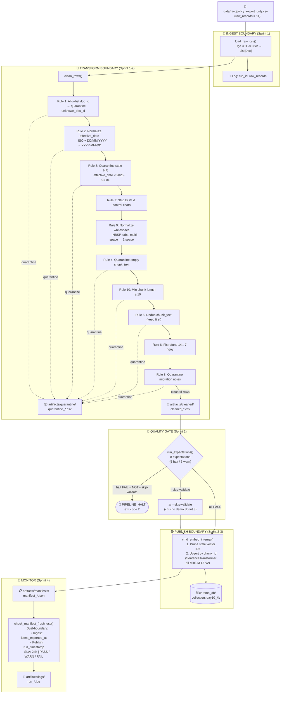
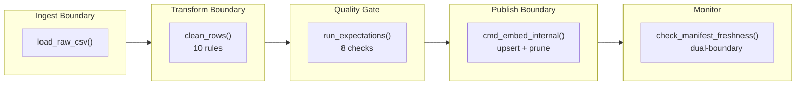

# Kiến trúc Pipeline — Lab Day 10

**Nhóm:** Nhóm Day10  
**Tác giả:** Mai Phi Hiếu (M5 — Monitoring / Docs Owner)  
**Cập nhật:** 2026-04-15

---

## 1. Sơ đồ luồng tổng quan



> **Điểm đo freshness (dual-boundary):**
> - **Ingest boundary:** `latest_exported_at` — max `exported_at` trong cleaned rows (thời điểm data xuất từ nguồn).
> - **Publish boundary:** `run_timestamp` — thời điểm manifest ghi xong = index visible.
> - **Processing delay:** `run_timestamp − latest_exported_at` = thời gian pipeline xử lý.
>
> **run_id** được ghi vào log, manifest, và metadata của mỗi vector trong Chroma.  
> **Quarantine** ghi toàn bộ row gốc + cột `reason` vào CSV riêng — không bao giờ tự động merge lại.

---

## 2. Ranh giới trách nhiệm (Boundary)



| Boundary | File | Input | Output | Owner |
|----------|------|-------|--------|-------|
| **Ingest** | `etl_pipeline.py` → `cleaning_rules.load_raw_csv()` | `data/raw/policy_export_dirty.csv` | `List[Dict]` raw rows (11 rows) | Nguyễn Năng Anh (M1) |
| **Transform** | `transform/cleaning_rules.py` → `clean_rows()` | raw rows | cleaned rows (6) + `quarantine_*.csv` (5) | Nguyễn Ngọc Hiếu (M2) |
| **Quality Gate** | `quality/expectations.py` → `run_expectations()` | cleaned rows | `List[ExpectationResult]`, halt flag | Phạm Thanh Tùng (M3) |
| **Publish** | `etl_pipeline.py` → `cmd_embed_internal()` | cleaned CSV rows | Chroma upsert + `manifest_*.json` | Dương Phương Thảo (M4) |
| **Monitor** | `monitoring/freshness_check.py` → `check_manifest_freshness()` | `manifest_*.json` | PASS / WARN / FAIL + log | Mai Phi Hiếu (M5) |

---

## 3. Chi tiết I/O từng boundary

### 3.1 Ingest Boundary

| Trường | Giá trị |
|--------|---------|
| **Input** | `data/raw/policy_export_dirty.csv` (UTF-8, 5 cột: `chunk_id, doc_id, chunk_text, effective_date, exported_at`) |
| **Output** | `List[Dict[str, str]]` — 11 rows trong CSV mẫu |
| **Log** | `run_id=<id>`, `raw_records=11` |
| **Failure mode** | File không tồn tại → exit 1; encoding sai → UnicodeDecodeError |

### 3.2 Transform Boundary

| Rule | Tên | Hành động | Metric Impact |
|------|-----|-----------|---------------|
| 1 | `allowlist_doc_id` | Quarantine nếu `doc_id ∉ {policy_refund_v4, sla_p1_2026, it_helpdesk_faq, hr_leave_policy}` | Row 9 (`legacy_catalog_xyz_zzz`) bị quarantine |
| 2 | `normalize_effective_date` | Parse ISO / DD/MM/YYYY → YYYY-MM-DD; quarantine nếu không parse được | Row 10 parse `01/02/2026` → `2026-02-01` |
| 3 | `quarantine_stale_hr` | HR có `effective_date < 2026-01-01` | Row 7 (HR 2025, 10 ngày phép) bị quarantine |
| 4 | `quarantine_empty_chunk` | `chunk_text` rỗng sau clean | Row 5 bị quarantine |
| 5 | `dedup_chunk_text` | Giữ bản đầu, quarantine trùng | Row 2 (trùng row 1) bị quarantine |
| 6 | `fix_refund_14→7` | Thay "14 ngày làm việc" → "7 ngày làm việc" + tag `[cleaned: stale_refund_window]` | Row 11 được fix |
| **7** (mới) | `strip_bom_control_chars` | Loại BOM, zero-width spaces | Ngăn false-negative dedup |
| **8** (mới) | `quarantine_migration_note` | Quarantine chunk chứa "lỗi migration" / "sync cũ" | Row 3 bị quarantine → `quarantine +1` |
| **9** (mới) | `normalize_whitespace` | NBSP, tabs → single space | Cải thiện dedup + embedding consistency |
| **10** (mới) | `validate_chunk_min_length` | Quarantine chunk < 10 ký tự | Chặn noise trước embedding |

**Kết quả CSV mẫu:** `cleaned_records=6`, `quarantine_records=5`

### 3.3 Quality Gate

| ID | Expectation | Severity | Mô tả |
|----|-------------|----------|-------|
| E1 | `min_one_row` | halt | Ít nhất 1 cleaned row |
| E2 | `no_empty_doc_id` | halt | Không `doc_id` rỗng |
| E3 | `refund_no_stale_14d_window` | halt | Không chunk refund chứa "14 ngày" |
| E4 | `chunk_min_length_8` | warn | Chunk ≥ 8 ký tự |
| E5 | `effective_date_iso_yyyy_mm_dd` | halt | Định dạng ISO |
| E6 | `hr_leave_no_stale_10d_annual` | halt | Không HR chứa "10 ngày phép năm" |
| **E7** (mới) | `exported_at_valid_iso_datetime` | halt | `exported_at` hợp lệ ISO datetime |
| **E8** (mới) | `chunk_text_no_stale_markers` | warn | Không marker "bản cũ" / "sync cũ" |

### 3.4 Publish Boundary

| Bước | Mô tả |
|------|-------|
| **Prune** | Lấy tất cả IDs trong Chroma collection → xóa IDs không còn trong cleaned run hiện tại |
| **Upsert** | `collection.upsert(ids, documents, metadatas)` — idempotent theo `chunk_id` |
| **Metadata** | Mỗi vector: `{doc_id, effective_date, run_id}` |
| **Manifest** | Ghi JSON: `run_id`, timestamps, counts, paths |

### 3.5 Monitor (Freshness)

| Boundary | Timestamp | Ý nghĩa |
|----------|-----------|---------|
| **Ingest** | `latest_exported_at` | Data export từ nguồn bao lâu rồi? |
| **Publish** | `run_timestamp` | Pipeline publish xong lúc nào? |
| **Delay** | `publish − ingest` | Pipeline mất bao lâu xử lý? |

**Ngưỡng:**  
- `age ≤ 75% SLA` → **PASS**  
- `75% SLA < age ≤ SLA` → **WARN**  
- `age > SLA` → **FAIL**

---

## 4. Idempotency & Rerun

Pipeline đảm bảo **idempotent** qua 2 cơ chế:

1. **`chunk_id` ổn định:** được tính bằng `SHA256(doc_id|chunk_text|seq)[:16]` — cùng dữ liệu → cùng id → Chroma `upsert` không tạo bản trùng.
2. **Prune stale vectors:** trước mỗi upsert, pipeline lấy toàn bộ id hiện có trong collection, xóa các id **không còn** trong cleaned run hiện tại (`embed_prune_removed` ghi trong log). Điều này đảm bảo index = snapshot của publish boundary, không tồn vector lạc hậu.

```
Rerun 2 lần cùng data → collection.count() không đổi ✓
```

**Chứng cứ từ log:**
```
# Lần 1 (inject → clean): embed_prune_removed=1 (xóa chunk refund cũ)
# Lần 2 (rerun cùng data): embed_upsert count=6, không prune → count giữ nguyên
```

---

## 5. Liên hệ Day 09

| | Day 09 | Day 10 |
|-|--------|--------|
| Corpus | Đọc `data/docs/*.txt` trực tiếp | Export CSV từ cùng `data/docs/` qua pipeline clean |
| Vector store | Collection Day 09 (tùy cấu hình) | `day10_kb` (tách biệt) |
| Embedding model | `all-MiniLM-L6-v2` | `all-MiniLM-L6-v2` (giống nhau) |
| Mục đích | RAG + multi-agent orchestration | Chứng minh data pipeline trước khi agent "đọc đúng version" |

> Pipeline Day 10 là tầng **ingest → clean → validate → publish** đảm bảo corpus sạch cho agent Day 09. Khi chạy Day 10 xong, collection `day10_kb` có thể thay thế collection Day 09 cho retrieval — cùng embedding model nên vector space tương thích.

---

## 6. Rủi ro đã biết & Mitigation

| Rủi ro | Mô tả | Mitigation | Tham chiếu |
|--------|-------|------------|------------|
| Stale vector | Rerun thiếu bước prune → vector cũ vẫn tồn trong index | Baseline đã có prune — kiểm `embed_prune_removed` trong log | `etl_pipeline.py` L156-164 |
| Version conflict HR | 2 bản HR (10 vs 12 ngày) cùng tồn tại nếu quarantine rule bị tắt | Rule 3 quarantine `effective_date < 2026-01-01` | `cleaning_rules.py` L226-235 |
| Freshness FAIL trên data mẫu | `exported_at = 2026-04-10`, SLA 24h → FAIL ngay | Giải thích hợp lý: SLA áp cho production batch; FAIL là mong đợi trên snapshot cũ | `runbook.md` Case 1 |
| Migration annotation leak | Metadata nội bộ lọt vào production chunk | Rule 8 quarantine regex pattern | `cleaning_rules.py` L99-120 |
| Model tải lần đầu chậm | `all-MiniLM-L6-v2` ~90MB tải từ HuggingFace | Cache sau lần đầu — cần mạng lần đầu chạy | `requirements.txt` |
| Hard-code HR cutoff | `2026-01-01` fixed trong code | Nên đọc từ `data_contract.yaml` (`policy_versioning.hr_leave_min_effective_date`) | Cải tiến đề xuất |

---

## 7. Lệnh chạy end-to-end

```bash
# 1. Setup
cd lab
pip install -r requirements.txt
cp .env.example .env

# 2. Pipeline chuẩn (clean data)
python etl_pipeline.py run --run-id final-submission

# 3. Kiểm tra freshness
python etl_pipeline.py freshness --manifest artifacts/manifests/manifest_final-submission.json

# 4. Eval retrieval
python eval_retrieval.py --out artifacts/eval/before_after_eval.csv

# 5. Grading (sau 17:00)
python grading_run.py --out artifacts/eval/grading_run.jsonl
```
