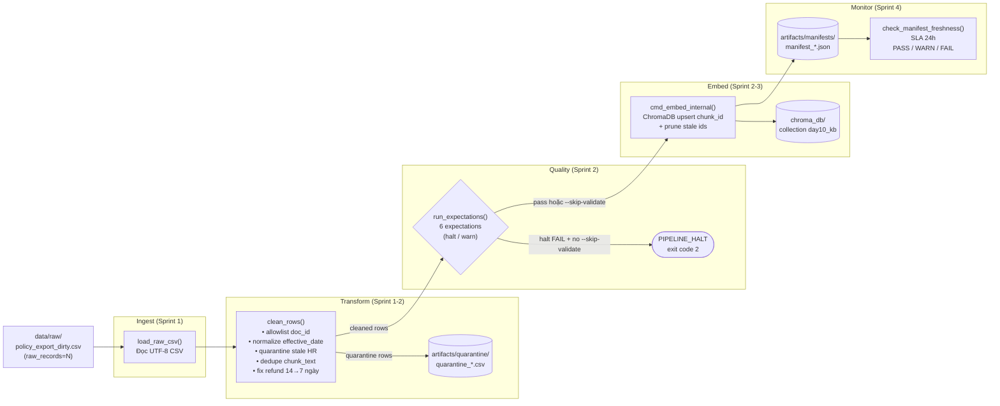

# Kiến trúc Pipeline — Lab Day 10

**Nhóm:** Nhóm Day10  
**Cập nhật:** 2026-04-15

---

## 1. Sơ đồ luồng



> **Điểm đo freshness:** trường `latest_exported_at` trong manifest (lấy từ `exported_at` lớn nhất của cleaned rows).  
> **run_id** được ghi vào log, manifest, và metadata của mỗi vector trong Chroma.  
> **Quarantine** ghi toàn bộ row gốc + cột `reason` vào CSV riêng — không bao giờ tự động merge lại.

---

## 2. Ranh giới trách nhiệm

| Thành phần | Input | Output | Owner |
|------------|-------|--------|-------|
| **Ingest** | `data/raw/policy_export_dirty.csv` | `List[Dict]` raw rows | Người 1 |
| **Transform** | raw rows | cleaned rows + `quarantine_*.csv` | Người 2 |
| **Quality** | cleaned rows | `List[ExpectationResult]`, halt flag | Người 3 |
| **Embed** | cleaned CSV → rows | Chroma collection upsert, `manifest_*.json` | Người 4 |
| **Monitor** | `manifest_*.json` | PASS / WARN / FAIL + log freshness | Người 5 |

---

## 3. Idempotency & Rerun

Pipeline đảm bảo **idempotent** qua 2 cơ chế:

1. **`chunk_id` ổn định:** được tính bằng `SHA256(doc_id|chunk_text|seq)[:16]` — cùng dữ liệu → cùng id → Chroma `upsert` không tạo bản trùng.
2. **Prune stale vectors:** trước mỗi upsert, pipeline lấy toàn bộ id hiện có trong collection, xóa các id **không còn** trong cleaned run hiện tại (`embed_prune_removed` ghi trong log). Điều này đảm bảo index = snapshot của publish boundary, không tồn vector lạc hậu.

```
Rerun 2 lần cùng data → collection.count() không đổi ✓
```

---

## 4. Liên hệ Day 09

| | Day 09 | Day 10 |
|-|--------|--------|
| Corpus | Đọc `data/docs/*.txt` trực tiếp | Export CSV từ cùng `data/docs/` qua pipeline clean |
| Vector store | Collection Day 09 (tùy cấu hình) | `day10_kb` (tách biệt) |
| Embedding model | `all-MiniLM-L6-v2` | `all-MiniLM-L6-v2` (giống nhau) |
| Mục đích | RAG + multi-agent | Chứng minh data pipeline trước khi agent "đọc đúng version" |

> Pipeline Day 10 là tầng **ingest → clean → validate → publish** đảm bảo corpus sạch cho agent Day 09. Khi chạy Day 10 xong, collection `day10_kb` có thể thay thế collection Day 09 cho retrieval.

---

## 5. Rủi ro đã biết

| Rủi ro | Mô tả | Mitigation |
|--------|-------|------------|
| Stale vector | Rerun thiếu bước prune → vector cũ vẫn tồn trong index | Baseline đã có prune — kiểm `embed_prune_removed` trong log |
| Version conflict HR | 2 bản HR (10 ngày vs 12 ngày) cùng tồn tại nếu quarantine rule bị tắt | Rule 3 trong `cleaning_rules.py` quarantine `effective_date < 2026-01-01` |
| Freshness FAIL trên data mẫu | `exported_at = 2026-04-10`, SLA 24h → FAIL ngay | Giải thích trong runbook: SLA áp cho "pipeline run", không phải "data snapshot" |
| Model tải lần đầu chậm | `all-MiniLM-L6-v2` ~90MB tải từ HuggingFace | Cache sau lần đầu — cần mạng lần đầu chạy |
